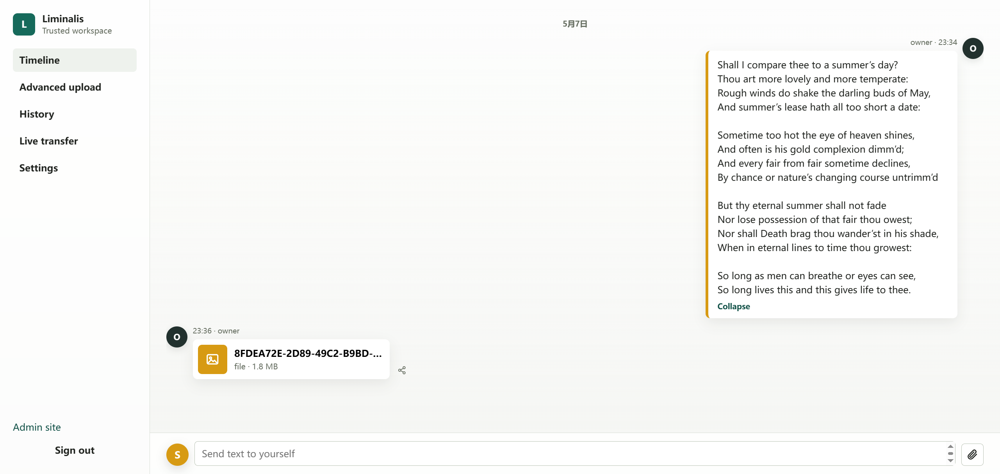

<h1 align="center">Liminalis</h1>

<p align="center">
  一个自托管的加密传输工作区，用于文件、文本、公开链接和浏览器到浏览器的实时传输。
</p>

<p align="center">
  <a href="README.md">English</a>
  ·
  <a href="#快速开始">快速开始</a>
  ·
  <a href="#安全模型">安全模型</a>
  ·
  <a href="docs/deployment/docker-compose.md">部署文档</a>
</p>

<p align="center">
  
  
  
  
</p>



## Liminalis 是什么？

Liminalis 是一个浏览器优先的传输工作区，适合把一台自己的服务器变成连接设备、浏览器和受信用户的小型私有中转站。它不是公共网盘，也不是聊天软件。它的主流程很简单：打开工作区，把文本或文件发给自己，再从另一台受信浏览器取回。

服务器负责保存运行状态和加密后的载荷。正文、文件名、文件夹路径、公开链接密钥和受信浏览器私钥材料，都由浏览器侧的加密层处理。

## 核心能力

| 范围 | 作用 |
| --- | --- |
| Timeline | 用工作区式时间线快速发送文本和简单文件。 |
| Advanced upload | 处理大文件、多文件、文件夹、分块传输和需要进度反馈的上传。 |
| 分享 | 支持从条目出发的用户分享、密码提取和带 fragment key 的公开链接。 |
| 受信浏览器 | 支持首个浏览器建立信任、后续浏览器配对，以及面向未来使用的恢复码。 |
| Live transfer | 支持需要双方确认的浏览器到浏览器文件会话、WebRTC 信令、relay fallback，以及策略允许时的 stored fallback。 |
| 管理站 | 独立管理站负责邀请、审批、用户、策略、存储、quota 和 Public Origin 设置。 |

## 快速开始

v1 推荐使用 Docker Compose 和干净的发布包部署。在一台新的 Debian 或 Ubuntu 主机上运行：

```bash
curl -fsSL https://raw.githubusercontent.com/NecrosisO-O/Liminalis/main/scripts/install.sh | bash -s -- --version v1.0.0-rc.1
```

安装脚本会询问安装目录、部署模式、公开 URL、本地端口和 PostgreSQL 绑定地址。它会安装缺失的系统包，下载部署包，创建 `.env`，拉取生产镜像，执行数据库迁移，初始化管理员账号，然后启动服务。

如果只是本地测试，并希望使用验收测试期间的端口：

```bash
curl -fsSL https://raw.githubusercontent.com/NecrosisO-O/Liminalis/main/scripts/install.sh | bash -s -- --version v1.0.0-rc.1 --local --yes --web-port 5173 --admin-port 3001
```

初始管理员密码只会在第一次创建 `.env` 时打印。关闭终端前请先保存。

## Docker Compose

生产部署包只包含部署文件：

```text
compose.yml
.env.example
README.md
VERSION
scripts/deploy.sh
scripts/install.sh
```

如果你已经拿到了部署包：

```bash
tar -xzf liminalis-deploy-v1.0.0-rc.1.tar.gz
cd liminalis-deploy-v1.0.0-rc.1
chmod +x scripts/deploy.sh
scripts/deploy.sh
```

默认公开部署形态如下：

| 服务 | 默认本地端口 | 生产 URL 示例 |
| --- | ---: | --- |
| 用户站 | `8080` | `https://app.example.com` |
| 管理站 | `8081` | `https://admin.example.com` |
| API | 容器内部 | 通过 `/api` 代理 |
| PostgreSQL | `127.0.0.1:5432` | 仅用于本机维护 |

更完整的部署、升级和备份说明见 [`docs/deployment/docker-compose.md`](docs/deployment/docker-compose.md)、[`docs/deployment/upgrade.md`](docs/deployment/upgrade.md) 和 [`docs/deployment/backup-restore.md`](docs/deployment/backup-restore.md)。

## 首次使用

部署完成后，先打开管理站。把实例的 Public Origin 设置为浏览器实际访问的用户站 URL，然后创建邀请、批准用户，再从用户站完成第一个受信浏览器设置。

新浏览器不会静默继承访问权。它需要发起带 short code 的配对请求，并由已有受信浏览器批准。产品提示保存恢复码时请保存好；恢复码可以恢复账号和受信浏览器面向未来内容的可用性，但如果所有本地密钥材料都丢失，它不会让旧的加密内容重新可读。

## 安全模型

Liminalis 围绕浏览器侧端到端加密设计。服务器不应看到明文正文、文件内容、文件名、文件夹路径、分组 manifest、公开链接密钥、受信设备私钥或用户域私钥。

私钥材料保存在浏览器 IndexedDB vault 中。公开链接使用类似 `/public/<token>#k=<secret>` 的 fragment-key URL，因此正常浏览器导航不会把 secret fragment 发送给服务器。

这个模型依赖浏览器 secure context。生产环境请使用 HTTPS。`localhost` 和 `127.0.0.1` 可以用于本地测试，但裸 LAN HTTP，例如 `http://192.168.x.x`，可能导致基于 WebCrypto 的信任建立失败。

## 日常运维

在部署目录中常用的命令：

```bash
docker compose ps
docker compose logs -f api
docker compose up -d
docker compose down
./scripts/deploy.sh
```

请把 `.env`、PostgreSQL volume 和加密存储 volume 放在一起备份。除非你明确想删除数据库和已存储的加密载荷，否则不要使用 `docker compose down -v`。

## 当前状态

Liminalis 当前处于 `v1.0.0-rc.1`。这个 release candidate 已包含生产部署包、GHCR 镜像、一键安装脚本、Docker Compose 部署、用户站、管理站、浏览器 E2EE、分享流程、live transfer 和大文件 advanced upload。

已知 v1 限制：advanced upload 不能跨刷新、离开页面或关闭浏览器恢复。上传大文件时应停留在上传页面直到完成。

## 开发

如果要做源码开发，可以使用仓库中的 npm workspaces：

```bash
npm install
npm run build
npm run lint
npm run test
```

源码 checkout 部署仍可用于开发和验证：

```bash
scripts/deploy.sh --source-build
```

生产部署建议优先使用干净部署包或一键安装脚本。

## 开源协议

Liminalis 使用 [GNU General Public License v3.0 only](LICENSE) 发布。
